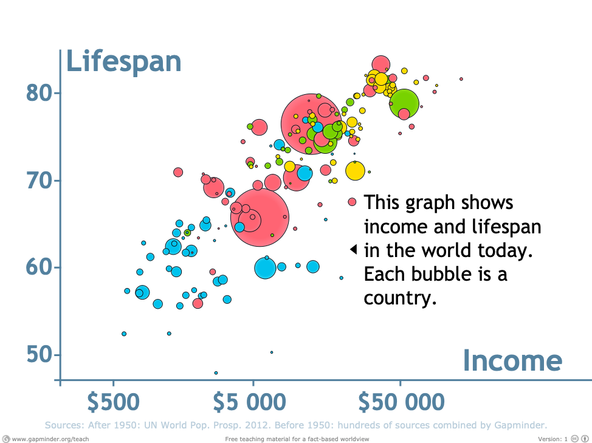
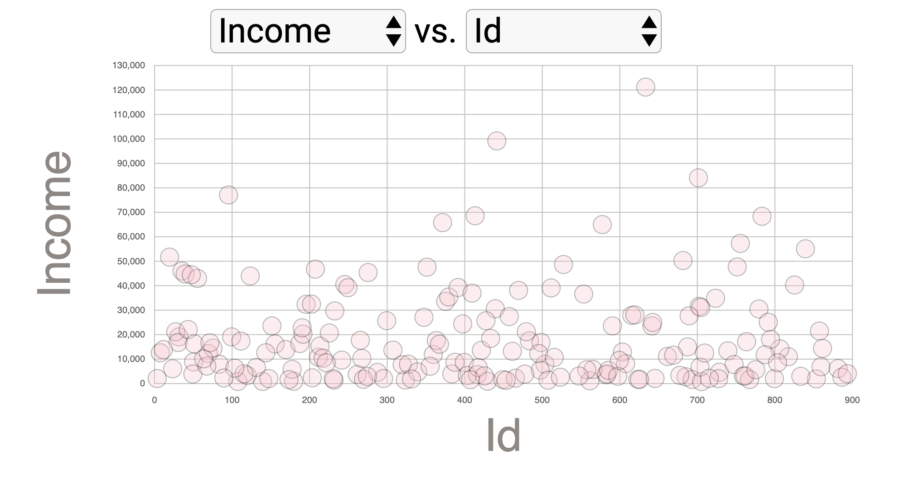
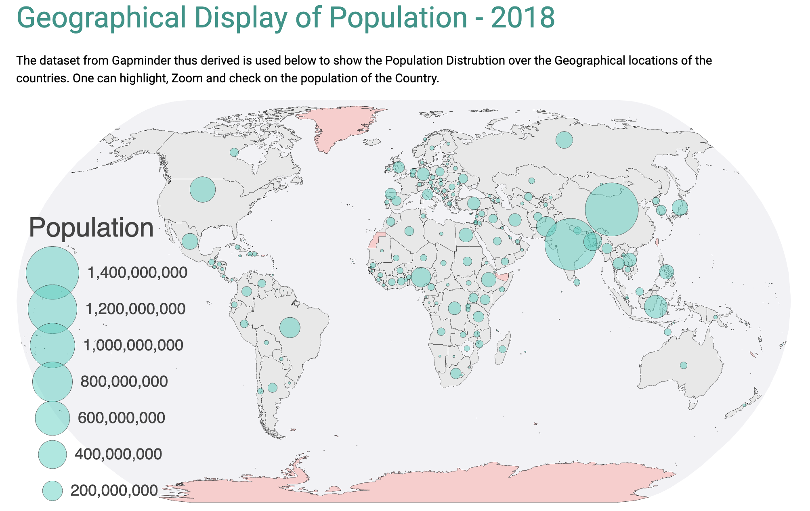
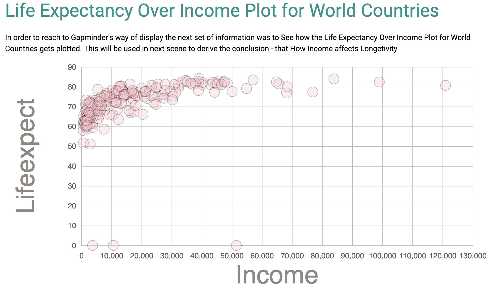
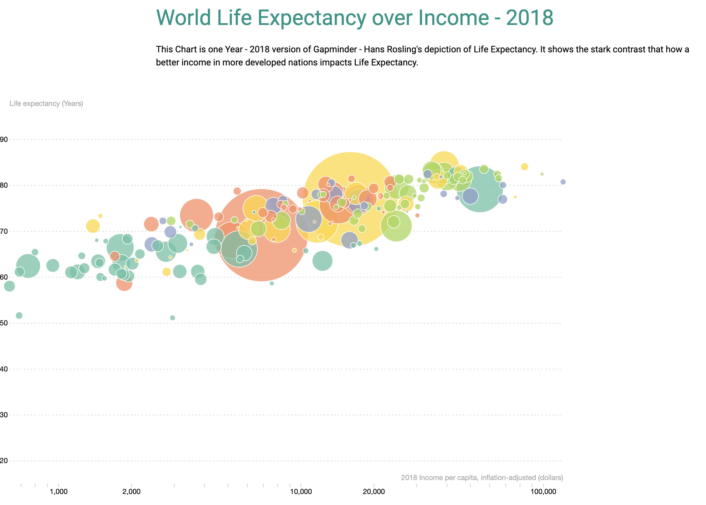

CS-498 - Narrative Visualization – By Ved Chugh (vedpc2)

World Nations Health/Wealth and Population.

These days the availability of Data and the swiftness in which it is getting generated helps us analyze and further investigate and conclude on various issues. 

So As part of the Narrative Visualization I have chosen to evaluate and work on World Nations Health/Wealth and Population by Prof. Hans Rosling through portal Gapminder (https://www.gapminder.org/tools/)

In the video Prof. Hans Rosling shows that people live longer in countries with a high GDP per capita. Low income countries have short life expectancy, and further no low-income countries have long life expectancy. 

In effort to recreate the above graph in D3, I used minute set of data for Year 2018. For same I had to curate the data outside D3, wherein I downloaded World population, World Life Expectancy, World Avg Income and Finally the Region - for Country/region Information. And joined them to form a single Dataset.

The narrative visualization is built with scenes, annotations, parameters, and triggers.

The First page talks about landing page - World Health/Wealth and Population – It is Dynamic Scatter Plot. Based on user’s selection of parameters it triggers the plotting of scatter plot between selections.

Below D3 Charting used Filtering as Parameters to Trigger the Plots of datasets as Scatter plots, which will be further used in various Plots in below Pages for further Analysis.

For example, in below Snapshot based on user selection from drop downs, the plot is drawn between Income and Country Id

The scenes follow a template for visual consistency and follow an order to best convey the message.

Thus, for approach towards Prof Hans Rosling - Gapminder’s view of Life Expectancy, the first scene has been kept free for user to see the distribution of Income/Population/Life Expectancy with Countries. 

The second scene follows to give more of a geographical perspective with sort of Interactive Slideshow, showing the geographical locations along with Population of countries.

 

This gives user the opportunity to explore and thus further zoom and hover over the countries for Tooltips and has annotations.

Moving further to next scene, were in a scatter plot as a prelim to Prof. Hans Rosling’s Life Expectancy view is displayed. This is more of a informative slide.

 
 
And finally, the Year 2018 data is used to generate the Life Expectancy Over Income Data.

  

This Chart is one Year - 2018 version of Gapminder - Hans Rosling's depiction of Life Expectancy. It shows the stark contrast that how a better income in more developed nations impacts Life Expectancy.

The D3 Chart has Life Expectancy in years over the Y Axis compared to the Average Income per capita. The chart gives user the option to explore further and check the Income/Life Expectancy of Countries.

The Chart helps deliver the message delivered by Prof. Hans Rosling - that people live longer in countries with a high GDP per capita. Low income countries have short life expectancy, and further no low-income countries have long life expectancy. 

My GitHub Repo - https://github.com/vedchugh/CS498-FinalProject-VedPC2

Citations:-
Gapminder.org - https://www.gapminder.org/free-material/
Data Viz- D3 Course - https://www.youtube.com/watch?v=_8V5o2UHG0E
Mike Bostock - https://bost.ocks.org/mike/
TopoJSON - https://github.com/topojson
